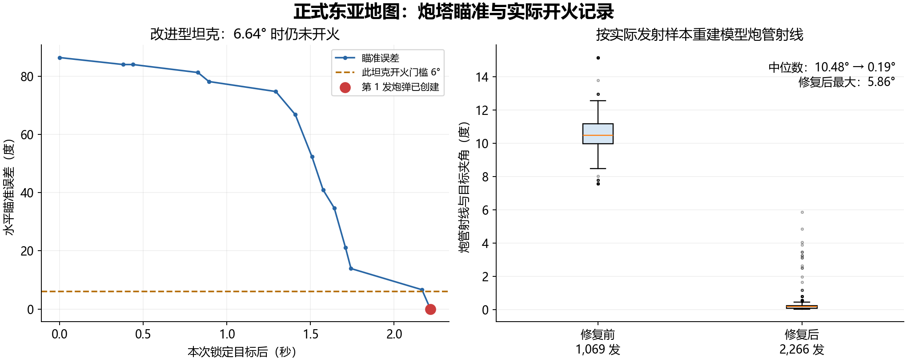

# 正式坦克瞄准与开火验证（0.2.3）

2026-09-10，在 Winyunq 的 `/Game/Map/EastAsia/64` 中发现并修正了炮口坐标错误。
原先内部瞄准门槛正常执行，但使用了碰撞体中心作为模型根坐标。正式坦克的模型由
原生渲染器向下移动 `320 × 0.1 = 32 cm`，使计算炮口比可见炮口高 32 cm。
所以内部角度误差接近零时，模型炮管仍可能偏离目标约 10°，炮弹却已经创建。

`CalculateMeshRootWorldTransform` 现在统一提供 Combat 瞄准、实际发射炮口和
Blueprint 姿态查询的根坐标，包含碰撞体底部偏移、局部倾斜、Visualize 变换和
renderer 默认偏移。它读取模拟数据，不依赖可见性或上一帧的渲染缓存。
没有修改 MassBattleFrame 源码，也没有改变原始攻击调度和弹道求解器。

## 正式运行证据

测试使用 14 种正式 Common Tank 配置、原始材质和原始 TankShell ProjectileConfig。
通过地图现有的 `MassUnitInHere` 在 Tick 0 生成 28 辆临时对战单位，加上南京原有的
2 辆坦克，共观察 30 辆。临时单位提高生命值以持续交战；配置只在内存开启两个射击
观察开关。使用现有外交接口设定敌对关系后，单位自行搜敌、转向和开火。
没有调用炮塔角度瞬移、目标覆盖或直接发射接口，没有保存临时地图或配置改动。

订阅 `OnFireRequest`，记录每次发射时的 Shooter、Target、ShotSequence、
SpawnedProjectile、炮口变换和角度状态。另按打包后实际角度重建模型炮管射线，
与目标方向独立比较。所有记录中的 `TargetOverrideMode` 都是 `None`。

| 指标 | 修复前 | 修复后 |
| --- | ---: | ---: |
| 记录的模型射线样本 | 1,069 发 | 2,266 发 |
| 炮管到目标夹角中位数 | 10.48° | 0.19° |
| 本批样本最大夹角 | 15.14° | 5.86° |
| 覆盖正式配置 | 14 种 | 14 种 |

修复后 2,266 发均返回成功创建的实际炮弹实体。两批记录时长和交战目标有所不同，
该表是运行记录的描述统计。32 cm 根坐标差另由配置、代码和原生渲染输入读回确认。

改进型坦克的一次真实首发过程如下；该配置水平误差门槛是 6°：

| 游戏时间（秒） | 水平瞄准误差 | 累计发射数 |
| ---: | ---: | ---: |
| 16.507 | 34.70° | 0 |
| 16.574 | 21.19° | 0 |
| 16.607 | 13.92° | 0 |
| 17.031 | 6.64° | 0 |
| 17.082（发射事件） | < 0.001° | 1 |

地图原有南京坦克也捕获了同类过程：游戏时间 130.993 秒时误差 12.95°、仍未发射；
131.026 秒时误差降至 4.25°，产生其第一发炮弹。此时炮管射线到目标夹角为 4.87°。

读回原生 Niagara 的 `LocationArray`、`OrientationArray`、`ScaleArray` 和
`StyleArray`，按每辆坦克的真实 InstanceId 重建炮口。30 辆均有有效输入，
其与修复后 CPU 姿态查询的最大位置差是 **0.265 cm**，包含角度/后坐量化误差。

## 检查与范围

- Runtime 模块冷编译成功；`MeshRootAim` 与 `PolicyGate` 自动化通过。
- `MeshRootAim` 覆盖正式 32 cm 偏移、炮管到目标射线，以及倾斜车体、相对碰撞体
  旋转和模型偏移的组合。
- 插件静态检查全部通过；测试生成的 Demo 资产已恢复，正式材质与地图未保存变更。
- Native Niagara 读回验证的是实际渲染输入；射击夹角对应发射的模拟采样，
  不是 GPU 完成插值后每个像素的测量。尚未用该记录证明所有移动速度、网络延迟
  或 GPU 插值时刻都满足同一角度上限。
- 原生弹道仍独立求解弹速和飞行路径，命中本身不作为炮管对准的证据。
- 当前正式 renderer 的实例 Offset 与默认 Offset 均为单位变换；本次不验证
  游戏运行中单独修改 renderer 实例 Offset 的情况。

可机器读取的[汇总](Validation/aim_before_fire_summary.json)与
[首发逐帧数据](Validation/aim_first_shot.csv)随文档保存。
完整本地原始记录位于插件 `Saved/AimBeforeFire/`：
`shots.jsonl`、`visual_shots_before.jsonl`、`After/shots.jsonl`、
`After/accepted_shots.csv`、`After/samples.json` 和
`After/native_render_readback.json`。观察脚本也在该目录，按 PID 选择编辑器运行。
